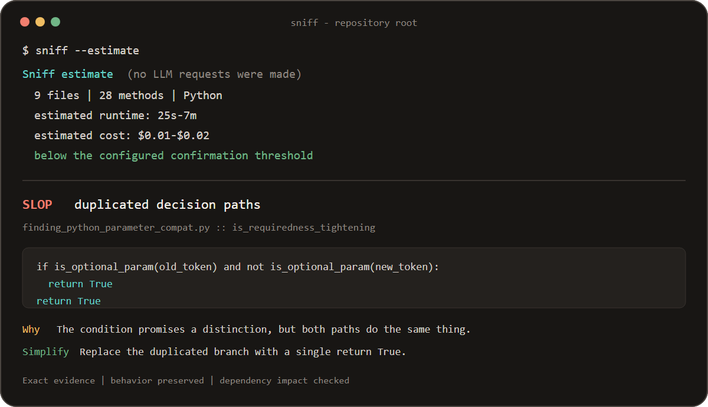

<div align="center">
  
  <h1>Sniff</h1>
  <p><strong>Exhaustive, LLM-backed slop detection for real codebases.</strong></p>
  <p>
    <a href="https://crates.io/crates/sniff-cli"></a>
    <a href="https://github.com/trysniff/sniff/actions/workflows/ci.yml"></a>
    <a href="LICENSE"></a>
  </p>
</div>

Sniff reviews every eligible method with repository context to find slop:

> Unnecessary or misleading implementation machinery that superficially
> satisfies a task while transferring disproportionate comprehension,
> verification, or change burden to future developers.

It does not matter whether AI or a human wrote the code. Sniff is not an
AI-authorship detector, security scanner, bug finder, linter, generic
maintainability score, architecture-opinion engine, IDE, automatic refactoring
tool, or PR reviewer.

> [!WARNING]
> **A normal Sniff scan sends source code to the LLM endpoint you configure.**
> Check that provider's retention, training, region, and privacy policy before
> scanning private code. `sniff --estimate`, `sniff doctor`, and `sniff status`
> are offline;
> only `sniff doctor --probe` and normal or resumed scans contact the provider.

## Quickstart

Install [Rust](https://rustup.rs), then install the published crate:

```console
cargo install sniff-cli --locked
```

The first install compiles native dependencies and can take several minutes.
After installation, this setup takes about a minute:

```console
# In the repository you want to inspect, create .env with the three values below.
SNIFF_API_KEY=your-deepseek-key
SNIFF_ENDPOINT=https://api.deepseek.com
SNIFF_MODEL=deepseek-v4-flash

# Validate configuration and source discovery without contacting the model.
sniff doctor

# See method count, runtime range, and cost range without contacting the model.
sniff --estimate

# Inspect durable progress without contacting the model.
sniff status

# Start the exhaustive review. Expensive scans ask for confirmation first.
sniff

# Continue an interrupted scan without repeating completed reviews.
sniff resume

# Optionally pause after about $0.50 of cumulative estimated scan spend.
sniff --budget-usd 0.50

# Rank and audit a precommitted blind OSS selection before labels or Sniff runs.
sniff benchmark prepare-selection selection-policy.json projects.csv selection-review.json
sniff benchmark audit-selection selection-policy.json projects.csv \
  selection-review.json selection-audit.json
sniff benchmark seal-sources selection-audit.json projects.csv \
  checkouts blind-source-seal.json
sniff benchmark prepare-labels blind-source-seal.json reviewer-a.json
sniff benchmark prepare-labels blind-source-seal.json reviewer-b.json
sniff benchmark audit-labels blind-source-seal.json label-audit.json \
  --review reviewer-a.json --review reviewer-b.json
sniff benchmark prepare-resolution blind-source-seal.json label-audit.json resolution.json
sniff benchmark resolve-labels blind-source-seal.json label-audit.json \
  resolution.json blind-cases.json
sniff benchmark validate-intentional-protocol non-blind-policy.json \
  history-population.json blind-source-seal.json boundary-protocol.json
sniff benchmark freeze draft.json corpus.json
sniff benchmark prepare-run corpus.json review.json --artifact .sniff/runs/RUN.json
sniff benchmark import-run corpus.json review.json run.json
sniff benchmark evaluate corpus.json submission.json
```

Sniff writes `sniff-report.md` at the scanned repository root. A successful run
reviews every eligible method; it never replaces failed AI reviews with a
static-only report.

Final scans with eligible methods and no retryable unresolved work also write a
versioned, hash-bound machine record under `.sniff/runs/`. It contains the
hashed scanned-source inventory, complete method ledger, final cases, semantic
coverage, provider/model contract, token usage, and the pricing snapshots used
for the displayed estimate. The directory is ignored by Git and is intended
for offline audit and later SniffBench import. Its `estimated_cost_usd` is not
an invoice: release benchmarking still requires separately verified actual
cost.

Each completed method is appended to a durable journal. `sniff status [PATH]`
reads that journal without loading provider configuration or scanning source
files. `sniff resume [PATH]` requires an existing journal and continues the
scan; changed or invalidated work is reviewed again.

`--budget-usd` is a cumulative estimated limit for one scan. Sniff stops
admitting new paid review batches when the journaled estimate reaches the
limit, drains and persists already-running review batches, exits with code `3`, and
does not write an incomplete report. Continue with a higher limit, for example
`sniff resume --budget-usd 1.00`. Concurrent in-flight requests can finish
above the limit, and configured token rates may differ from the provider's
invoice, so this is a resumable admission control rather than an exact billing
cap.

## SniffBench Evaluation

The blind OSS workflow operates entirely offline after its sampling-frame file
has been obtained. `prepare-selection POLICY FRAME OUTPUT` verifies the exact
frame SHA-256, deterministically hash-ranks its repositories from a precommitted
seed, and emits the complete ranked assessment prefix without consulting labels
or Sniff output. Complete every candidate with a quota language, method census,
typed repository facts, exactly one canonical fact payload, at least one retained
raw-source payload, and either a selected
immutable revision or a typed exclusion. `audit-selection POLICY FRAME WORKSHEET
OUTPUT` rejects skipped/reordered candidates, contradictory evidence, premature
quota claims, and incomplete quotas, then writes an immutable selection audit.
Each selected repository fills the quota for its dominant eligible-method
language; equal method counts use lexicographic language order as the fixed
tie-break, and source sealing rederives that assignment from committed source.
The audit commitment proves exactly what was assessed and preserves the raw
payloads for independent review; it does not make an unverifiable external
claim true. Selected repository identity, revision, license path, method count,
quota language, and declared context are independently rederived from the local
checkouts during source sealing. External exclusion facts such as inaccessible,
archived, or fork status remain reviewable attestations unless their retained
source payload can be independently reproduced.

`sniff benchmark seal-sources AUDIT FRAME CHECKOUT_ROOT OUTPUT` revalidates the
audit against the exact frame and requires each selected GitHub repository at
`CHECKOUT_ROOT/OWNER/REPOSITORY`. Checkouts must be clean, non-sparse Git roots at
their audited complete commit IDs. The command copies Sniff-supported production
sources, tests, common package/build/API contracts, explicitly declared context,
and license evidence into a create-new bundle. It embeds the exact selection
audit and frame, reproduces every audited method count and quota language, and
stores no operator filesystem paths. Only production methods enter the eligible
census; context remains separately hash-bound for human review. Commit or attest
this label-free source seal before creating labels or running Sniff. The later
corpus must hash-bind it and assign every sealed blind method to exactly one
adjudicated case.

`sniff benchmark prepare-labels SEAL OUTPUT` creates a source-only worksheet for
one independent reviewer. It contains every sealed method and exact source, but
no Sniff output or prefilled label, plus the sealed repository source, tests, and
declared contract context needed to inspect callers and intent. Reviewers must
attest that they inspected the repository context. Complete separate worksheets
without sharing answers. `sniff benchmark audit-labels SEAL OUTPUT --review A --review B`
requires at least two distinct experienced reviewers, verifies the complete
method census and immutable source facts, rejects unblinded or incomplete
worksheets, and preserves every tier, mechanism, or related-method disagreement
as an explicit dispute. Reviewers must explicitly classify Clean intentional
boundaries; Sniff never infers that benchmark label from paths or names. Both
commands are offline.

`sniff benchmark prepare-resolution SEAL AUDIT OUTPUT` creates a human-resolution
draft. Undisputed tiers, mechanisms, and cross-method components are immutable
and prefilled; disputed labels remain blank. Complete resolver identity, every
dispute rationale, and hash-bound after/proof artifacts for findings.
`sniff benchmark resolve-labels SEAL AUDIT RESOLUTION OUTPUT` requires a distinct
resolver for disputes, refuses omitted or multiply assigned methods, verifies
after artifacts relative to the resolution manifest, and emits a committed
corpus-ready blind-case bundle. It never generates a label or counterfactual
itself. Both commands are offline.

`sniff benchmark freeze DRAFT OUTPUT` verifies every declared local source
snapshot, computes separate SHA-256 commitments for analyzed sources and hidden
labels, verifies the referenced source seal and exhaustive blind-method
coverage, verifies that every BlindOss label exactly matches the committed
independent-resolution bundle, verifies the separately precommitted non-blind
real-evidence seal, and creates a new immutable SniffBench v6 corpus manifest without
overwriting files.

`sniff benchmark evaluate CORPUS SUBMISSION` evaluates that corpus and
three or more complete runs. The corpus binds labels and local before/after
source snapshots by SHA-256. The submission binds provider/model identity,
actual usage and cost, proof levels, exact evidence, blind reviewer outcomes,
and complete competitor ledgers to that corpus. Missing or invented coverage,
tampered snapshots or labels, invalid evidence, unstable verdicts, duplicate
findings, weak real-world or blind-OSS metrics, and incomplete baseline results
fail closed. Synthetic fixtures remain development signals and cannot carry the
release gate. The command is fully offline: it never loads provider
configuration or sends source code to an API.

`sniff benchmark prepare-run` verifies one immutable completed-run artifact per
frozen repository revision. Completed artifacts must be inside the benchmark
bundle; the generated worksheet stores only portable relative paths. It exposes
opaque case IDs, source snapshots, and Sniff's committed outcomes, never frozen
labels or label-side case IDs.

After an experienced independent reviewer records finding matches,
dispositions, measured review time, identity, affiliation, and a label-blindness
attestation, `sniff benchmark import-run` re-derives every protected field and
emits one verified `BenchmarkRun`. The worksheet must also identify actual
provider cost and wall-clock time. Cost evidence is a hash-verified JSON receipt
inside the benchmark bundle; the receipt binds provider, model, USD amount,
provenance, and the hash of the underlying invoice or usage export. Neither
command contacts a provider, and neither accepts estimated cost as actual
spend.

## What A Finding Looks Like

This finding came from a completed scan, not a hand-written demo:

```text
[Slop][ai] duplicated decision paths

The condition appears to distinguish an optional-to-required transition, but
both paths return True. The branch communicates a distinction that does not
exist and makes the method harder to trust.

Exact evidence:
    if is_optional_param(old_token) and not is_optional_param(new_token):
        return True
    return True

Behavior-preserving simplification:
    return True
```

The evidence is exact, the friction is named, and the proposed simplification
does not change the callable contract, return behavior, or side effects.

The preview combines output from the offline fixture smoke test with the real
Bumpkin finding above.



## OSS Validation

Sniff is tested against pinned third-party repositories, and analyzer mistakes
are published alongside the fixes they forced. The current studies cover
[Ky (TypeScript)](case-studies/ky.md),
[Turbine (Kotlin)](case-studies/turbine.md),
[fd (Rust)](case-studies/fd.md),
[httpcore (Python)](case-studies/httpcore.md), and
[CertMagic (Go)](case-studies/certmagic.md).

See the [validation method and aggregate results](case-studies/README.md).
Zero findings means no slop satisfied Sniff's evidence contract; it is not a
claim that a repository is perfect.

## Cost Before Commitment

`sniff --estimate [PATH]` parses the repository locally and reports:

- supported files and methods
- language breakdown
- conservative input and output token ranges
- expected request and runtime ranges
- estimated cost using your configured provider rates

It makes **zero LLM requests**. A normal scan pauses before its first review
when the upper estimate crosses `$1`, two hours, or 2,000 methods. Interactive
runs ask for confirmation; automation must pass `--yes` explicitly. Override
the cost threshold with `SNIFF_CONFIRM_COST_USD`.

Measured dogfood run on 2026-08-02:

| Repository | Commit | Model | Coverage | Runtime | Estimated cost |
| --- | --- | --- | ---: | ---: | ---: |
| Bumpkin | `593a522` | `deepseek-v4-flash` | 1,222 / 1,222 methods | 1h 15m | $0.6912 |

That is one real run, not a universal benchmark. Provider latency, cache hits,
repository shape, retries, and response length all change runtime and cost.
The estimate uses configured rates; the final report is still an estimate, not
the provider's invoice.

## Provider Configuration

Sniff uses `SNIFF_API_KEY`, `SNIFF_ENDPOINT`, and `SNIFF_MODEL`. These examples
were checked against provider documentation on 2026-08-05. Prices and model
availability can change, so verify the linked provider page before a large run.

### DeepSeek

```dotenv
SNIFF_API_KEY=your-deepseek-key
SNIFF_ENDPOINT=https://api.deepseek.com
SNIFF_MODEL=deepseek-v4-flash
SNIFF_INPUT_COST_PER_MILLION=0.14
SNIFF_CACHED_INPUT_COST_PER_MILLION=0.0028
SNIFF_OUTPUT_COST_PER_MILLION=0.28
```

[DeepSeek models and current pricing](https://api-docs.deepseek.com/quick_start/pricing/)

### OpenAI

```dotenv
SNIFF_API_KEY=your-openai-key
SNIFF_ENDPOINT=https://api.openai.com/v1
SNIFF_MODEL=gpt-4.1-mini
SNIFF_INPUT_COST_PER_MILLION=0.40
SNIFF_CACHED_INPUT_COST_PER_MILLION=0.10
SNIFF_OUTPUT_COST_PER_MILLION=1.60
```

[OpenAI GPT-4.1 mini model and pricing](https://developers.openai.com/api/docs/models/gpt-4.1-mini)

### Anthropic

```dotenv
SNIFF_API_KEY=your-anthropic-key
SNIFF_ENDPOINT=https://api.anthropic.com
SNIFF_MODEL=claude-haiku-4-5-20251001
SNIFF_INPUT_COST_PER_MILLION=1.00
SNIFF_CACHED_INPUT_COST_PER_MILLION=0.10
SNIFF_OUTPUT_COST_PER_MILLION=5.00
```

[Anthropic models](https://platform.claude.com/docs/en/about-claude/models/overview)
and [Anthropic pricing](https://platform.claude.com/docs/en/about-claude/pricing)

### OpenRouter

```dotenv
SNIFF_API_KEY=your-openrouter-key
SNIFF_ENDPOINT=https://openrouter.ai/api/v1
SNIFF_MODEL=anthropic/claude-haiku-4.5
SNIFF_INPUT_COST_PER_MILLION=1.00
SNIFF_CACHED_INPUT_COST_PER_MILLION=0.10
SNIFF_OUTPUT_COST_PER_MILLION=5.00
```

[OpenRouter's model page](https://openrouter.ai/anthropic/claude-haiku-4.5/api)
lists the current model slug, providers, data policies, and prices. Routing can
change the effective price, so configure the rates for the route you choose.

## Diagnose Setup

```console
sniff doctor [PATH]
```

`doctor` checks the target, `.env` loading, API key presence, endpoint syntax,
model, supported source discovery, and report permissions without contacting
the provider. To explicitly test authentication and response compatibility with
one small paid request:

```console
sniff doctor --probe [PATH]
```

The command labels that request as paid before sending it.

## Run

```console
sniff [PATH]
sniff --skip-dotenv [PATH]
sniff --yes [PATH]
```

### Optional behavioral proof

Sniff never guesses or shells out to a repository test runner. To let a
counterfactual earn test or differential proof, declare argv explicitly in
`sniff.config.toml`:

```toml
[proof]
test_command = ["python", "-m", "pytest", "tests"]
# Optional: a deterministic probe whose bounded output must match exactly.
differential_command = ["python", "scripts", "behavior_probe.py"]
```

The original and edited snapshots run through an isolated worker. Missing
commands, failing baselines, output differences, or unavailable platform
isolation remain unresolved; Sniff never falls back to executing repository
code on the host. Windows requires a hardened runner configured through
`SNIFF_SANDBOX_RUNNER`.

Every eligible method is reviewed. Supported source languages are Rust, Python,
JavaScript, TypeScript, Go, and Kotlin/JVM. Android/KMP Gradle projects are
detected explicitly and fail closed until an Android-capable SCIP provider is
available; Sniff does not fall back to name-based graph guesses.

Sniff runs up to four independent review pipelines concurrently and batches up
to eight same-file methods per request. Tune these with
`SNIFF_LLM_MAX_CONCURRENCY` and `SNIFF_LLM_METHOD_BATCH_SIZE`, each from `1` to
`8`. Methods from different files are never batched together.

Transient transport failures are retried up to 128 times within a 30-minute
budget by default. Malformed responses have a separate three-repair budget.
Tune these with `SNIFF_LLM_MAX_ATTEMPTS`, `SNIFF_LLM_RETRY_BUDGET_SECS`, and
`SNIFF_LLM_MAX_FORMAT_REPAIRS`. Fatal HTTP responses still fail immediately.

## Reliability Contract

Static analysis supplies repository evidence and graph context. The LLM reviews
every eligible method and returns `Slop`, `Kinda Slop`, `Clean`, or `Unresolved`.
A reported finding must include exact source evidence, a recognized slop-shaped
reason, contract impact, dependency proof, and a behavior-preserving
simplification.

Parsing, configuration, transport, response validation, incomplete coverage,
and report-writing failures are fatal. Sniff never emits a partial report as a
successful result. Every completed review is durably appended to a local journal
for safe resume; changed source, semantic context, or review contracts invalidate
stale entries.

A completed machine record is emitted only after exhaustive method and compiler
coverage and all required synthesis, adjudication, and proof units finish. Cache
reuse is recorded explicitly; reused scans are not independent SniffBench
repeatability trials.

Per-file semantic artifacts are cached separately under the operating system's
user cache directory and reused only when their source hash, language, cache
format, and index contract match. Set `SNIFF_CACHE_DIR` to choose another local
cache root. Corrupt or mismatched artifacts fail the scan instead of silently
falling back to weaker indexing. The cache contains source code and is written
with private local permissions where the platform supports them; protect it like
the scanned repository.

Exit codes:

- `0`: complete report with no findings
- `1`: complete report containing `Slop` or `Kinda Slop`
- `2`: failed scan; no valid new report was produced

## Development

```console
cargo fmt --all -- --check
cargo clippy --all-targets --locked -- -D warnings
cargo test --all-targets --locked
cargo package --locked --target-dir target/package-check
```

See [CONTRIBUTING.md](CONTRIBUTING.md) and [SECURITY.md](SECURITY.md).

## License

Sniff is licensed under the GNU Affero General Public License, version 3. See
[LICENSE](LICENSE) and [TRADEMARKS.md](TRADEMARKS.md).
